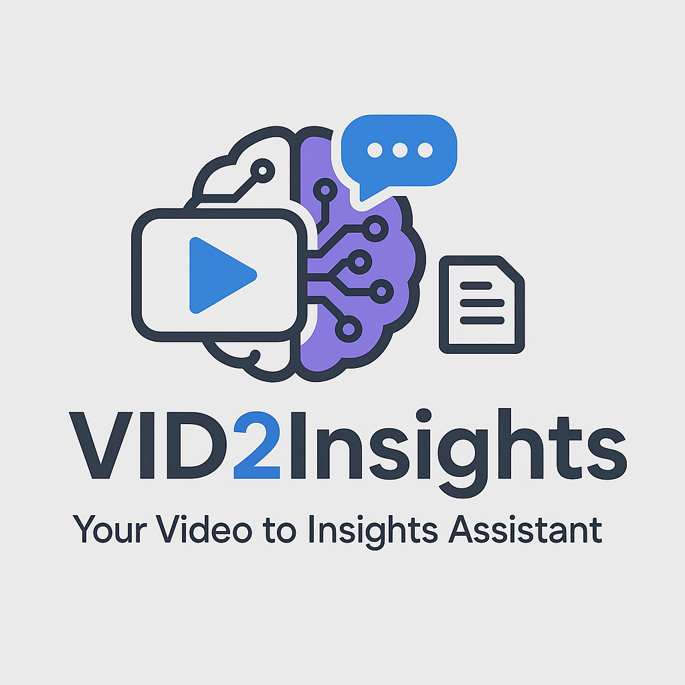

# VID2Insights (Your Video to Insights Assistant)




---

## Project Description

### Business Use Case

#### Overview
Our platform transforms raw video content into actionable insights through two specialist agents—**Documentation & Executive Summaries** and **Student Tutor**—powered by a customizable transcript pipeline that can feed any downstream agent.

---

#### Corporate Perspective

**Challenge**
- Enterprises generate vast amounts of video assets (product demos, webinars, training sessions) but struggle to:
  - Quickly extract key messages for decision-makers
  - Maintain consistent, branded documentation at scale
  - Integrate video insights into CRMs, knowledge bases, or BI tools

**Solution**
1. **Automated Executive Summaries**
   - Input: Full-length video + auto-generated transcript
   - Output: 1-page brief highlighting goals, outcomes, and action items
   - Benefit: Senior leadership receives concise overviews in minutes

2. **Product Documentation Generator**
   - Input: Technical walkthrough videos
   - Output: Structured user guides with step-by-step instructions and code snippets
   - Benefit: Reduces manual authoring time by up to 80%

3. **Downstream Integration**
   - The standardized transcript can be consumed by any internal or third-party agent (e.g., search indexes, automated tagging, sentiment analysis engines)
   - Ensures seamless data flow across BI dashboards, ticketing systems, and collaboration platforms

---

#### Educational Perspective

**Challenge**
- Academic institutions and e-learning providers produce lecture recordings and tutorial videos but face hurdles in:
  - Engaging diverse learning styles
  - Generating practice materials without manual effort
  - Tracking student progress through multimedia content

**Solution**
1. **Adaptive Student Tutor**
   - Input: Lecture video + synchronized transcript
   - Output:
     - Customized multiple-choice quizzes aligned to key concepts
     - Personalized study plans highlighting strengths and gaps
   - Benefit: Enhances retention and tailors learning paths to each student

2. **Interactive Q&A Chat**
   - Leverages the same transcript to power a conversational agent
   - Allows students to ask context-aware questions and dive deeper on demand

3. **Downstream Agent Flexibility**
   - Transcript becomes the single source of truth for:
     - Analytics dashboards tracking concept mastery
     - Automated grading assistants
     - Supplemental content recommenders

---

#### Technical Highlight: Universal Transcript

- **High-fidelity transcript generation** captures every spoken detail.
- **Modular design** lets you plug the transcript into:
  - Documentation agent
  - Tutoring agent
  - Analytics pipelines
  - Custom downstream workflows

By centralizing on a robust transcript, organizations accelerate time-to-value for every specialist agent and ensure consistent, reusable insights across corporate and educational domains.

---

## Features

### Adaptive Video Analysis
* Streamlit UI for seamless video upload and user input
* Custom window-size detection to tune analysis accuracy based on content dynamics

### Rich Video Context Generation
* Processing pipeline that extracts semantic cues, scene changes and keyframes
* Assembles a structured knowledge base for downstream agents

### Specialist Agents

#### Documentation & Executive Summaries
* Automated product documentation generation
* Concise, executive-ready overviews of video content 

#### Student Tutor
* Creation of tailored MCQs for self-assessment
* Personalized study planners to guide learning

### Iterative Copilot Experience
* Real-time interaction to refine outputs
* Step-by-step modifications and feedback, just like a coding copilot 

### Open Chat Assistant
* Context-aware chat powered by video transcript
* Ask questions, dive deeper into topics, and explore insights on the fly

---

## Tech Stack

- `>Python 3.12`
- `Streamlit`
- `OpenCV`
- `LangChain & LangGraph`
- `Mistral & Gemini AI`
- `Pillow / ImageHash`
- `FPDF`
- `ffmpeg`
---

## Project Structure

```
.
├── vid2insight/
│   ├── agent/
│   │   ├── __init__.py
│   │   ├── common/
│   │   │   ├── __init__.py
│   │   │   └── nodes.py
│   │   ├── config/
│   │   │   ├── __init__.py
│   │   │   ├── assistant_config.py
│   │   │   ├── base_config.py
│   │   │   ├── constants.py
│   │   │   ├── initialize_logger.py
│   │   │   └── logger_config.yaml
│   │   ├── data/
│   │   │   └── __init__.py
│   │   ├── doc_agent/
│   │   │   ├── state/
│   │   │   │   ├── __init__.py
│   │   │   │   ├── agent_state.py
│   │   │   │   └── output_state.py
│   │   │   ├── __init__.py
│   │   │   ├── constants.py
│   │   │   ├── doc_graph.py
│   │   │   ├── nodes.py
│   │   │   └── prompts.py
│   │   ├── state/
│   │   │   ├── __init__.py
│   │   │   ├── agent_state.py
│   │   │   ├── input_state.py
│   │   │   └── output_state.py
│   │   ├── student_agent/
│   │   │   ├── state/
│   │   │   │   ├── __init__.py
│   │   │   │   ├── agent_state.py
│   │   │   │   └── output_state.py
│   │   │   ├── tools/
│   │   │   │   └── __init__.py
│   │   │   ├── __init__.py
│   │   │   ├── constants.py
│   │   │   ├── student_graph.py
│   │   │   ├── nodes.py
│   │   │   └── prompts.py
│   │   ├── ui/
│   │   │   ├── __init__.py
│   │   │   └── ui.py
│   │   ├── utils/
│   │   │   ├── __init__.py
│   │   │   └── misc_utils.py
│   │   ├── constants.py
│   │   ├── nodes.py
│   │   ├── prompts.py
│   │   └── vid2_insight_graph.py
│   ├── ingestion/
│   │   ├── __init__.py
│   │   ├── audio_extractor.py
│   │   ├── audio_transcript_generator.py
│   │   ├── combined_text_transcriptor.py
│   │   ├── combined_transcript_generator.py
│   │   ├── constants.py
│   │   ├── frame_extractor.py
│   │   ├── frame_json_parser.py
│   │   ├── frame_transcript_generator.py
│   │   ├── prompts.py
│   │   └── transcriptor.py
│   ├── docs/
│   ├── utils/
│   │   └── __init__.py
│   └── vid2_insight_graph.py
├── docs/
│   └── __init__.py
├── .gitignore
├── pyproject.toml
├── README.md
├── Dockerfile
└── templates/
    └── __init__.py
```

---

## How to Run

### 1. Clone the Repo

```bash
git clone https://github.com/adityam-iisc/vid2insight.git
cd vid2insiight
```

### 2. Setup virtual env

```bash
python3.13 -m venv venv
source venv/bin/activate
 ```

### 3. Install Dependencies

```bash
pip install poetry
poetry lock
poetry install --no-root
```

### 4. Set Environment Variables

Create a `.env` file:

```
GOOGLE_API_KEY=your-key
```

### 5. Run the App
If you are currently inside the agent directory, navigate to the ui directory & run:
```bash
streamlit run ui.py
```
